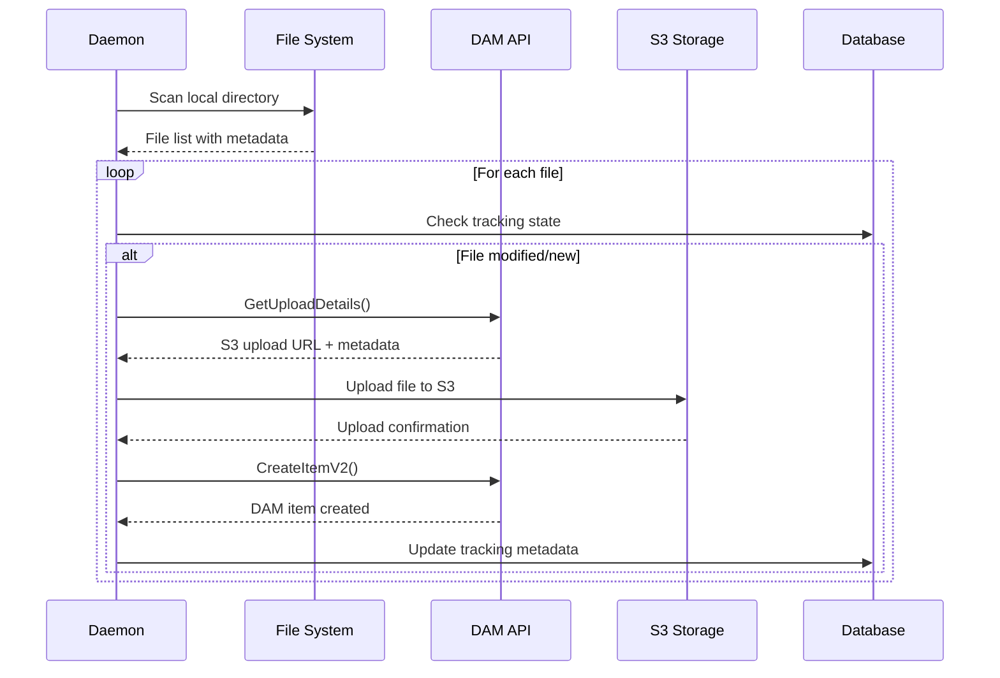

# Architecture Documentation

## System Architecture Overview

Brandshare DAM Sync follows **Clean Architecture** principles, ensuring separation of concerns, testability, and maintainability. The system is designed for cross-platform deployment and supports multiple synchronization strategies.

## Architectural Principles

### Clean Architecture Layers

The system is organized into distinct layers with well-defined boundaries:


### Dependency Flow

- **Outer layers depend on inner layers**
- **Inner layers are independent of outer layers**
- **Dependencies point inward** (Dependency Inversion Principle)

## Core Components

### 1. Domain Layer

#### Entities

- **SyncJob**: Represents a synchronization job configuration
  - Properties: JobName, VolumePath, SyncDirection, JobInterval
  - Navigation: Related Tenant, tracking metadata

- **FileEntity**: Tracks individual file metadata and sync state
  - Properties: FileName, FilePath, ModifiedAt, ChecksumHash
  - Audit: CreatedAt, LastModified, LastSeenSyncId

- **Folder**: Directory structure tracking
  - Properties: Path, Label, ParentId, IsActive
  - Hierarchy: Parent-child relationships

- **Tenant**: Multi-tenant configuration
  - Properties: BaseUrl, ApiKey, Domain
  - Isolation: Tenant-scoped data access

#### Enums

- **SyncJobStatus**: Created, Running, Succeeded, Failed, Cancelled
- **TrackedItemState**: Pending, Queued, Processing, Synced, Deleted, Failed
- **SyncDirection**: L2D (Local to DAM), D2L (DAM to Local), Both
- **FileChangeKind**: Created, Changed, Deleted, Renamed

### 2. Application Layer

#### CQRS Implementation

**Commands** (Write Operations):
- `CreateJobCommand`: Creates new sync jobs
- Command handlers implement business logic
- Use `IUnitOfWork` for transactional consistency

**Queries** (Read Operations):
- `GetJobByIdQuery`: Retrieves specific job details
- `GetTenantsQuery`: Lists configured tenants
- Query handlers optimize for read scenarios

#### MediatR Integration

```csharp
// Example command handling
public class CreateJobCommandHandler : IRequestHandler<CreateJobCommand, JobDto>
{
    private readonly IUnitOfWork _unitOfWork;
    
    public async Task<JobDto> Handle(CreateJobCommand request, CancellationToken cancellationToken)
    {
        // Business logic implementation
        // Repository operations through UnitOfWork
        // Return result
    }
}
```

### 3. Infrastructure Layer

#### DAM API Client

Built with **Refit** for type-safe HTTP client generation:

```csharp
public interface IBrandShareDamApi
{
    [Get("/FileSync/GetFolders")]
    Task<ApiResponse<List<FolderSummary>>> GetFolders(
        [Header("TenantId")] string tenantId, 
        [AliasAs("jobId")] string jobId);
        
    [Post("/FileSync/CreateItemV2")]
    Task<ApiResponse<CreateItemResponse>> CreateItemV2(
        [Header("TenantId")] string tenantId, 
        [Body] CreateItemV2Request request);
}
```

**Features**:
- Automatic JSON serialization/deserialization
- Header-based authentication
- Tenant-aware requests
- Comprehensive endpoint coverage

#### Resilience Patterns (Polly)

```csharp
services.AddRefitClient<IBrandShareDamApi>()
    .AddPolicyHandler(HttpPolicyExtensions
        .HandleTransientHttpError()
        .WaitAndRetryAsync(retryCount: 3, sleepDurationProvider: attempt => 
            TimeSpan.FromSeconds(Math.Pow(2, attempt))))
    .AddPolicyHandler(HttpPolicyExtensions
        .HandleTransientHttpError()
        .CircuitBreakerAsync(5, TimeSpan.FromSeconds(30)));
```

#### Persistence Layer

**Entity Framework Core** with **SQLite**:

- **DbContext**: `DamSyncDbContext` with audit interceptors
- **Repositories**: Generic repository pattern implementation
- **Unit of Work**: Transactional consistency across operations
- **Migrations**: Database schema versioning

**Key Features**:
- Soft delete with global query filters
- Automatic audit trail (Created/Modified timestamps)
- Tenant isolation at data level

### 4. Sync Strategy Pattern

#### Job Executor Architecture


#### Strategy Implementation

```csharp
public interface IJobExecutorService
{
    Task ExecuteJobAsync((string syncId, string tenantId, string jobId) syncJobInfo, 
                        CancellationToken ct = default);
}

// Registered with keyed services
services.AddKeyedTransient<IJobExecutorService, OneWayDownloadJobExecutor>(SyncJobType.DOWNLOAD);
services.AddKeyedTransient<IJobExecutorService, OneWayUploadJobExecutor>(SyncJobType.UPLOAD);
```

## Sync Flow Architecture

### Download Sync Flow


### Upload Sync Flow



## Configuration Architecture

### Multi-Tenant Support

```csharp
public class TenantContext : ITenantContext
{
    public async Task<TenantConfig> GetTenantConfigAsync(string tenantId)
    {
        // Retrieve tenant-specific configuration
        // BaseUrl, ApiKey, additional settings
    }
}

public class TenantConfigHandler : DelegatingHandler
{
    // Dynamically sets BaseAddress and Authorization headers
    // Based on current tenant context
}
```

### Dependency Injection

```csharp
// Application layer registration
services.AddMediatR(Assembly.GetExecutingAssembly());

// Infrastructure layer registration
services.AddRefitClient<IBrandShareDamApi>()
    .ConfigureHttpClient(/* tenant-aware configuration */)
    .AddHttpMessageHandler<TenantConfigHandler>();

// Persistence layer registration
services.AddDbContext<DamSyncDbContext>(options =>
    options.UseSqlite(connectionString));
```

## Background Processing

### Worker Service Architecture


### Hosted Service Implementation

```csharp
public class Worker : BackgroundService
{
    protected override async Task ExecuteAsync(CancellationToken stoppingToken)
    {
        var interval = TimeSpan.FromMinutes(5);
        
        while (!stoppingToken.IsCancellationRequested)
        {
            try
            {
                await ProcessSyncJobs(stoppingToken);
            }
            catch (Exception ex)
            {
                _logger.LogError(ex, "Sync cycle failed");
            }
            
            await Task.Delay(interval, stoppingToken);
        }
    }
}
```

## Security Architecture

### API Authentication

- **Header-based authentication** with tenant-specific API keys
- **Dynamic header injection** via HTTP message handlers
- **Secure key storage** in configuration or key vaults

### File System Security

- **Restricted directory access** based on job configurations
- **Path validation** to prevent directory traversal
- **Permission checking** before file operations

### Tenant Isolation

- **Database-level isolation** with tenant ID filtering
- **API request isolation** with tenant headers
- **Configuration isolation** per tenant instance

## Scalability Considerations

### Concurrent Processing

- **Download coordination** with configurable limits
- **Async/await patterns** throughout
- **Cancellation token propagation** for graceful shutdown

### Resource Management

- **Memory-efficient streaming** for large files
- **Connection pooling** for HTTP clients
- **Database connection management** via EF Core

### Monitoring and Observability

- **Structured logging** with correlation IDs
- **Performance counters** for sync operations
- **Health checks** for external dependencies

## Deployment Architecture

### Cross-Platform Support

- **.NET 9 runtime** for cross-platform compatibility
- **Self-contained deployments** with runtime bundling
- **Platform-specific optimizations** via publish profiles

### Service Deployment

- **Windows Service** support with service registration
- **Systemd integration** for Linux environments
- **Docker containerization** capabilities

### Configuration Management

- **Environment-specific settings** via appsettings.json
- **User secrets** for development environments
- **Environment variables** for production configuration

This architecture ensures maintainability, scalability, and testability while providing robust synchronization capabilities between local file systems and DAM instances.